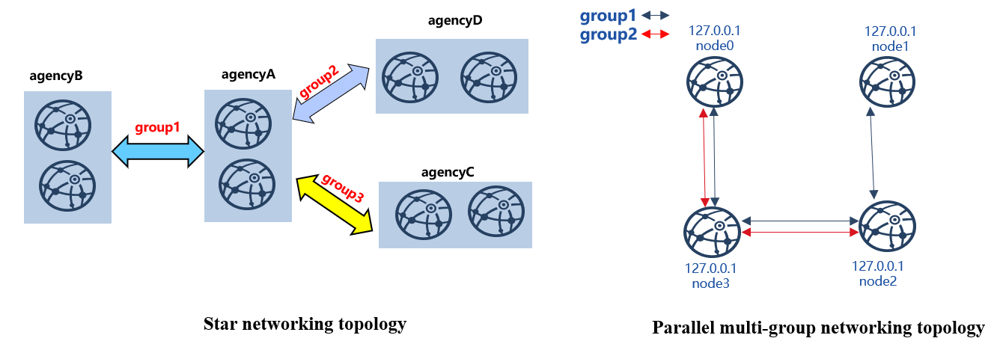

# Deploy Multi-Group Blockchain System

This chapter takes the star networking and parallel multi-group networking as an example to guide you to the following.

- Learn to deploy multi-group blockchain with `build_chain.sh` shell script;
- Understand the organization of the multi-group blockchain created by `build_chain.sh`
- Learn how to start the blockchain node and get the consensus status of each group through the log;
- Learn how to send transactions to the given group and get the block generation status through the log;
- Understand node management of the blockchain system, including how to add/remove the given consensus node;
- Learn how to create a new group.

```eval_rst
.. important::
    - ``build_chain.sh`` is suitable for developers and users to use quickly

    - Build an enterprise-level business chain, recommend to use `generator <../enterprise_tools/index.html>`_
```

## Introduction of star networking topology and parallel multi-group networking topology

As shown in the following figure, the star networking topology and the parallel multi-group networking topology are two widely used networking methods in blockchain applications.

- **Star networking topology**: The nodes of the central agency belong to multiple groups, and runs multiple institutional applications. Nodes of the other agencies belongs to different groups and runs their respective applications;
- **Parallel multi-group networking topology**: Each node in the blockchain belongs to multiple groups and can be used for multi-service expansion or multi-node expansion of the same service.



The following is a detailed description of how to deploy a eight-node star networking blockchain system and a four-node parallel multi-group networking blockchain.

## Installation dependency

Before deploying the FISCO BCOS blockchain, you need to install software such as `openssl`, `curl`, etc. The specific commands are as follows:

```bash
# CentOS
$ sudo yum install -y openssl curl

# Ubuntu
$ sudo apt install -y openssl curl

# Mac OS
$ brew install openssl curl
```

## Star networking topology

In this chapter, we deploy a star networking blockchain system with four agencies, three groups and eight nodes in the local machine.

Here is the detailed configuration of star networking blockchain:

- `agencyA`: belongs to `group1、group2、group3`, including 2 nodes with the same IP address `127.0.0.1`;
- `agencyB`: belongs to `group1`, including 2 nodes with the same IP address `127.0.0.1`;
- `agencyC`: belongs to `group2`, including 2 nodes with the same IP address `127.0.0.1`;
- `agencyD`: belongs to `group3`, including 2 nodes with the same IP address `127.0.0.1`.


In a star network topology, the core node (in this case, the agencyA node) belongs to all groups and has a high load. It is recommended to deploy it separately on a machine with better performance.

```eval_rst
.. important::
   - In the actual application scenario, it is **not recommended to deploy multiple nodes on the same machine**. It is recommended to select the number of deployed nodes in one machine according to the **machine loading**. Please refer to the `hardware configuration <../manual/configuration.html>`_

   - **In a star network topology**, the core node (in this case, the agencyA node) belongs to all groups and has a high load. It is recommended to deploy it separately on a machine with better performance.

   - **When operating in different machines, please copy the generated IP folder to the corresponding machine to start. The chain building operation only needs to be performed once!**
```

### Generate configuration for star networking blockchain

`build_chain.sh` supports to generate configurations for blockchain with any topology, you can use this script to build configuration for the star networking blockchain.

**Prepare for dependency**

- Create an operation directory

```bash
mkdir -p ~/fisco && cd ~/fisco
```

- Download the build_chain.sh script
```bash
curl -#LO https://github.com/FISCO-BCOS/FISCO-BCOS/releases/download/v2.7.2/build_chain.sh && chmod u+x build_chain.sh
```

```eval_rst
.. note::
    - If the script cannot be downloaded for a long time due to network problems, try `curl -#LO https://gitee.com/FISCO-BCOS/FISCO-BCOS/raw/master/tools/gen_node_cert.sh`
```

**Generate configuration for star networking blockchain system**
```bash
# Generate ip_list(configuration)
$ cat > ipconf << EOF
127.0.0.1:2 agencyA 1,2,3
127.0.0.1:2 agencyB 1
127.0.0.1:2 agencyC 2
127.0.0.1:2 agencyD 3
EOF

# Check the content of ip_list
$ cat ipconf
# Meaning of the space-separated parameters:
# ip:num: IP of the physical machine and the number of nodes
# agency_name: agency name
# group_list: the list of groups the nodes belong to, groups are separated by comma
127.0.0.1:2 agencyA 1,2,3
127.0.0.1:2 agencyB 1
127.0.0.1:2 agencyC 2
127.0.0.1:2 agencyD 3
```

**Create node configuration folder for star networking blockchain using build_chain script**

Please refer to the [build_chain](../manual/build_chain.md) for more parameter descriptions of `build_chain.sh`.

```bash
# Generate a blockchain of star networking and make sure ports 30300~30301, 20200~20201, 8545~8546 of the local machine are not occupied
$ bash build_chain.sh -f ipconf -p 30300,20200,8545
Generating CA key...
==============================================================
Generating keys ...
Processing IP:127.0.0.1 Total:2 Agency:agencyA Groups:1,2,3
Processing IP:127.0.0.1 Total:2 Agency:agencyB Groups:1
Processing IP:127.0.0.1 Total:2 Agency:agencyC Groups:2
Processing IP:127.0.0.1 Total:2 Agency:agencyD Groups:3
==============================================================
......Here to omit other outputs......
==============================================================
[INFO] FISCO-BCOS Path   : ./bin/fisco-bcos
[INFO] IP List File      : ipconf
[INFO] Start Port        : 30300 20200 8545
[INFO] Server IP         : 127.0.0.1:2 127.0.0.1:2 127.0.0.1:2 127.0.0.1:2
[INFO] State Type        : storage
[INFO] RPC listen IP     : 127.0.0.1
[INFO] Output Dir        : /home/ubuntu16/fisco/nodes
[INFO] CA Key Path       : /home/ubuntu16/fisco/nodes/cert/ca.key
==============================================================
[INFO] All completed. Files in /home/ubuntu16/fisco/nodes

# The generated node file is as follows:
nodes
|-- 127.0.0.1
|   |-- fisco-bcos
|   |-- node0
|   |   |-- conf  # node configuration folder
|   |   |   |-- ca.crt
|   |   |   |-- group.1.genesis
|   |   |   |-- group.1.ini
|   |   |   |-- group.2.genesis
|   |   |   |-- group.2.ini
|   |   |   |-- group.3.genesis
|   |   |   |-- group.3.ini
|   |   |   |-- node.crt
|   |   |   |-- node.key
|   |   |   `-- node.nodeid # stores the information of Node ID
|   |   |-- config.ini # node configuration file
|   |   |-- start.sh  # shell script to start the node
|   |   `-- stop.sh   # shell script to stop the node
|   |-- node1
|   |   |-- conf
......omit other outputs here......
```

```eval_rst
.. note::
   If the generated nodes belong to different physical machines, the blockchain nodes need to be copied to the corresponding physical machine.
```

**Start node**

FISCO-BCOS provides the `start_all.sh` and `stop_all.sh` scripts to start and stop the node.

```bash
# Switch to the node directory
$ cd ~/fisco/nodes/127.0.0.1

# Start the node
$ bash start_all.sh

# Check node process
$ ps aux | grep fisco-bcos
ubuntu16         301  0.8  0.0 986644  7452 pts/0    Sl   15:21   0:00 /home/ubuntu16/fisco/nodes/127.0.0.1/node5/../fisco-bcos -c config.ini
ubuntu16         306  0.9  0.0 986644  6928 pts/0    Sl   15:21   0:00 /home/ubuntu16/fisco/nodes/127.0.0.1/node6/../fisco-bcos -c config.ini
ubuntu16         311  0.9  0.0 986644  7184 pts/0    Sl   15:21   0:00 /home/ubuntu16/fisco/nodes/127.0.0.1/node7/../fisco-bcos -c config.ini
ubuntu16      131048  2.1  0.0 1429036 7452 pts/0    Sl   15:21   0:00 /home/ubuntu16/fisco/nodes/127.0.0.1/node0/../fisco-bcos -c config.ini
ubuntu16      131053  2.1  0.0 1429032 7180 pts/0    Sl   15:21   0:00 /home/ubuntu16/fisco/nodes/127.0.0.1/node1/../fisco-bcos -c config.ini
ubuntu16      131058  0.8  0.0 986644  7928 pts/0    Sl   15:21   0:00 /home/ubuntu16/fisco/nodes/127.0.0.1/node2/../fisco-bcos -c config.ini
ubuntu16      131063  0.8  0.0 986644  7452 pts/0    Sl   15:21   0:00 /home/ubuntu16/fisco/nodes/127.0.0.1/node3/../fisco-bcos -c config.ini
ubuntu16      131068  0.8  0.0 986644  7672 pts/0    Sl   15:21   0:00 /home/ubuntu16/fisco/nodes/127.0.0.1/node4/../fisco-bcos -c config.ini
```

**Check consensus status of groups**

When no transaction is sent, the node with normal consensus status will output `+++` log. In this example, `node0` and `node1` belong to `group1`, `group2` and `group3`; `node2` and `node3` belong to `group1`; `node4` and `node5` belong to `group2`; `node6` and `node7` belong to `group3`. Check the status of node by `tail -f node*/log/* | grep "++"`.

```eval_rst
.. important::

    Node with normal consensus status prints ``+++`` log, fields of ``+++`` log are defined as:
     - ``g:``: group ID;
     - ``blkNum``: the newest block number generated by the Leader node;
     - ``tx``: the number of transactions included in the new block;
     - ``nodeIdx``: the index of this node;
     - ``hash``: hash of the newest block generated by consensus nodes.
```

```bash
# Check if node0 group1 is normal(Ctrl+c returns to the command line)
$ tail -f node0/log/* | grep "g:1.*++"
info|2019-02-11 15:33:09.914042| [g:1][p:264][CONSENSUS][SEALER]++++++++Generating seal on,blkNum=1,tx=0,nodeIdx=2,hash=72254a42....

# Check if node0 group2 is normal
$ tail -f node0/log/* | grep "g:2.*++"
info|2019-02-11 15:33:31.021697| [g:2][p:520][CONSENSUS][SEALER]++++++++Generating seal on,blkNum=1,tx=0,nodeIdx=3,hash=ef59cf17...

# ... To check node1, node2 node for each group is normal or not, refer to the above operation method...

# Check if node3 group1 is normal
$ tail -f node3/log/*| grep "g:1.*++"
info|2019-02-11 15:39:43.927167| [g:1][p:264][CONSENSUS][SEALER]++++++++Generating seal on,blkNum=1,tx=0,nodeIdx=3,hash=5e94bf63...

# Check if node5 group2 is normal
$ tail -f node5/log/* | grep "g:2.*++"
info|2019-02-11 15:39:42.922510| [g:2][p:520][CONSENSUS][SEALER]++++++++Generating seal on,blkNum=1,tx=0,nodeIdx=2,hash=b80a724d...

```

### Configuration console

The console connects to the FISCO BCOS node, it is used to query the blockchain status and deploy the calling contract, etc. Please refer to [here](../console/console_with_of_sdk.md) for the console manual for version 2.6 and above, and [here](../console/console.md) for the console manual for version 1.x.


```eval_rst
.. important::
   The console relies on Java 8 and above, and Ubuntu 16.04 system needs be installed with openjdk 8. Please install Oracle Java 8 or above for CentOS.
```

```bash
# Switch back to ~/fisco folder
$ cd ~/fisco

# Download console
$ curl -#LO https://github.com/FISCO-BCOS/console/releases/download/v2.7.1/download_console.sh

# If you have network issue for exec command above, please try:
$ curl -#LO https://gitee.com/FISCO-BCOS/console/raw/master/tools/download_console.sh

$ bash download_console.sh

# Switch to console directory
$ cd console

# Copy node certificate of group 2 to the configuration directory of console
$ cp ~/fisco/nodes/127.0.0.1/sdk/* conf/

# Obtain channel_listen_port of node0
$ grep "channel_listen_port" ~/fisco/nodes/127.0.0.1/node*/config.ini
/home/ubuntu16/fisco/nodes/127.0.0.1/node0/config.ini:    channel_listen_port=20200
/home/ubuntu16/fisco/nodes/127.0.0.1/node1/config.ini:    channel_listen_port=20201
/home/ubuntu16/fisco/nodes/127.0.0.1/node2/config.ini:    channel_listen_port=20202
/home/ubuntu16/fisco/nodes/127.0.0.1/node3/config.ini:    channel_listen_port=20203
/home/ubuntu16/fisco/nodes/127.0.0.1/node4/config.ini:    channel_listen_port=20204
/home/ubuntu16/fisco/nodes/127.0.0.1/node5/config.ini:    channel_listen_port=20205
/home/ubuntu16/fisco/nodes/127.0.0.1/node6/config.ini:    channel_listen_port=20206
/home/ubuntu16/fisco/nodes/127.0.0.1/node7/config.ini:    channel_listen_port=20207

# configure the console
$ cp ~/fisco/console/conf/config-example.toml ~/fisco/console/conf/config.toml

```

```eval_rst
.. important::
    When connecting node with the console, we should make sure that the connected nodes are in the group configured by the console
```

**Start the console**

```bash
$ bash start.sh
# The following information output indicates that the console is successfully started. If the startup fails, check whether the certificate configuration and the channel listen port configuration are correct.
=====================================================================================
Welcome to FISCO BCOS console(2.6.1)!
Type 'help' or 'h' for help. Type 'quit' or 'q' to quit console.
 ________ ______  ______   ______   ______       _______   ______   ______   ______
|        |      \/      \ /      \ /      \     |       \ /      \ /      \ /      \
| $$$$$$$$\$$$$$|  $$$$$$|  $$$$$$|  $$$$$$\    | $$$$$$$|  $$$$$$|  $$$$$$|  $$$$$$\
| $$__     | $$ | $$___\$| $$   \$| $$  | $$    | $$__/ $| $$   \$| $$  | $| $$___\$$
| $$  \    | $$  \$$    \| $$     | $$  | $$    | $$    $| $$     | $$  | $$\$$    \
| $$$$$    | $$  _\$$$$$$| $$   __| $$  | $$    | $$$$$$$| $$   __| $$  | $$_\$$$$$$\
| $$      _| $$_|  \__| $| $$__/  | $$__/ $$    | $$__/ $| $$__/  | $$__/ $|  \__| $$
| $$     |   $$ \\$$    $$\$$    $$\$$    $$    | $$    $$\$$    $$\$$    $$\$$    $$
 \$$      \$$$$$$ \$$$$$$  \$$$$$$  \$$$$$$      \$$$$$$$  \$$$$$$  \$$$$$$  \$$$$$$

=====================================================================================
[group:1]>
```

### Send transactions to groups

In the above section, we learned how to configure the console, this section will introduce how to send transactions to groups through the console.

```eval_rst
.. important::

   In the group architecture, the ledgers are independent in each group. And sending transactions to one group only increases the block number of this group but not others
```

**Send transactions through console**

```bash
# ... Send HelloWorld transaction to group1...
$ [group:1]> deploy HelloWorld
transaction hash: 0xd0305411e36d2ca9c1a4df93e761c820f0a464367b8feb9e3fa40b0f68eb23fa
contract address:0x8c17cf316c1063ab6c89df875e96c9f0f5b2f744
# Check the current block number of group1, if the block number is increased to 1,  it indicates that the blockchain is normal. Otherwise, please check if group1 is abnormal.
$ [group:1]> getBlockNumber
1

# ... Send HelloWorld transaction to group2...
# Switch to group2
$ [group:1]> switch 2
Switched to group 2.
# Send transaction to group2, return a transaction hash indicates that the transaction is deployed successfully, otherwise, please check if the group2 works normally.
$ [group:2]> deploy HelloWorld
transaction hash: 0xd0305411e36d2ca9c1a4df93e761c820f0a464367b8feb9e3fa40b0f68eb23fa
contract address:0x8c17cf316c1063ab6c89df875e96c9f0f5b2f744
# Check the current block number of group2, if the block number is increased to 1,  it indicates that the blockchain is normal. Otherwise, please check if group1 is abnormal
$ [group:2]> getBlockNumber
1

# ... Send transaction to group3...
# Switch to group3
$ [group:2]> switch 3
Switched to group 3.
# Send transaction to group3, return a transaction hash indicates that the transaction is deployed successfully, otherwise, please check if the group2 works normally.
$ [group:3]> deploy HelloWorld
contract address:0x8c17cf316c1063ab6c89df875e96c9f0f5b2f744
# Check the current block number of group3, if the block number is increased to 1,  it indicates that the blockchain is normal. Otherwise, please check if group1 is abnormal
$ [group:3]> getBlockNumber
1

# ... Switch to group 4 that does not exist: the console prompts that group4 does not exist, and outputs the current group list ...
$ [group:3]> switch 4
Group 4 does not exist. The group list is [1, 2, 3].

# Exit the console
$ [group:3]> exit
```

**Check the log**

After the block is generated, the node will output `Report` log, which contains fields with following definitions:

```eval_rst
.. important:

    once a new block is generated, node will print a Report log which contains fields with following definitions:
     - ``g:``: group ID
     - ``num``: block number
     - ``sealerIdx``: index of the consensus node;
     - ``hash``: the hash of the block;
     - ``next``: the number of next block;
     - ``tx``: the number of transactions included in the block;
     - ``nodeIdx``: index of the current node.
```

```bash
# Switch the node directory
$ cd ~/fisco/nodes/127.0.0.1

# Check the block generation status of group1: new block generated
$ cat node0/log/* |grep "g:1.*Report"
info|2019-02-11 16:08:45.077484| [g:1][p:264][CONSENSUS][PBFT]^^^^^^^^Report,num=1,sealerIdx=1,hash=9b5487a6...,next=2,tx=1,nodeIdx=2

# Check the block generation status of group2: new block generated
$ cat node0/log/* |grep "g:2.*Report"
info|2019-02-11 16:11:55.354881| [g:2][p:520][CONSENSUS][PBFT]^^^^^^^^Report,num=1,sealerIdx=0,hash=434b6e07...,next=2,tx=1,nodeIdx=0

# Check the block generation status of group3: new block generated
$ cat node0/log/* |grep "g:3.*Report"
info|2019-02-11 16:14:33.930978| [g:3][p:776][CONSENSUS][PBFT]^^^^^^^^Report,num=1,sealerIdx=1,hash=3a42fcd1...,next=2,tx=1,nodeIdx=2

```

### Node joins the group
Through the console, FISCO BCOS can add the specified node to the specified group, or delete the node from the specified group. For details, please refer to the [node admission management manual](../manual/node_management.md), for console configuration, please reference [console operation manual](../console/console.html#id7).

Taking how to join node2 to group2 as an example, this chapter introduces how to add a new node to an existing group.

```eval_rst
.. important:

    Before the new node joins the group, make sure that:

    - The NodeID of the new-joined node exists.
    - The normal consensus of the nodes in the group: he nodes with normal consensus will output +++ logs
```

**Copy group2 configuration to node2**

```bash
# Switch to node directory
$ cd ~/fisco/nodes/127.0.0.1

# ... Copy group2 configuration of node0 to node2 ...
$ cp node0/conf/group.2.* node2/conf

# ...Restart node2(make sure the node is in normal consensus after restart)...
$ cd node2 && bash stop.sh && bash start.sh
```

**Get the ID of node2**

```bash
# Please remember the node ID of node2. Add node2 to group2 needs the node ID.
$ cat conf/node.nodeid
6dc585319e4cf7d73ede73819c6966ea4bed74aadbbcba1bbb777132f63d355965c3502bed7a04425d99cdcfb7694a1c133079e6d9b0ab080e3b874882b95ff4
```

**Send commands to group2 through the console to add node2 into group2**

```bash

# ...Go back to the console directory and launch the console (direct boot to group2)...
$ cd ~/fisco/console && bash start.sh 2

# ...Join node2 as a consensus node through the console...
# 1. Check current consensus node list
$ [group:2]> getSealerList
[
    9217e87c6b76184cf70a5a77930ad5886ea68aefbcce1909bdb799e45b520baa53d5bb9a5edddeab94751df179d54d41e6e5b83c338af0a19c0611200b830442,
    227c600c2e52d8ec37aa9f8de8db016ddc1c8a30bb77ec7608b99ee2233480d4c06337d2461e24c26617b6fd53acfa6124ca23a8aa98cb090a675f9b40a9b106,
    7a50b646fcd9ac7dd0b87299f79ccaa2a4b3af875bd0947221ba6dec1c1ba4add7f7f690c95cf3e796296cf4adc989f4c7ae7c8a37f4505229922fb6df13bb9e,
    8b2c4204982d2a2937261e648c20fe80d256dfb47bda27b420e76697897b0b0ebb42c140b4e8bf0f27dfee64c946039739467b073cf60d923a12c4f96d1c7da6
]
# 2. Add node2 to the consensus node
# The parameter after addSealer is the node ID obtained in the previous step
$ [group:2]> addSealer 6dc585319e4cf7d73ede73819c6966ea4bed74aadbbcba1bbb777132f63d355965c3502bed7a04425d99cdcfb7694a1c133079e6d9b0ab080e3b874882b95ff4
{
    "code":0,
    "msg":"success"
}
# 3. Check current consensus node list
$ [group:2]> getSealerList
[
    9217e87c6b76184cf70a5a77930ad5886ea68aefbcce1909bdb799e45b520baa53d5bb9a5edddeab94751df179d54d41e6e5b83c338af0a19c0611200b830442,
    227c600c2e52d8ec37aa9f8de8db016ddc1c8a30bb77ec7608b99ee2233480d4c06337d2461e24c26617b6fd53acfa6124ca23a8aa98cb090a675f9b40a9b106,
    7a50b646fcd9ac7dd0b87299f79ccaa2a4b3af875bd0947221ba6dec1c1ba4add7f7f690c95cf3e796296cf4adc989f4c7ae7c8a37f4505229922fb6df13bb9e,
    8b2c4204982d2a2937261e648c20fe80d256dfb47bda27b420e76697897b0b0ebb42c140b4e8bf0f27dfee64c946039739467b073cf60d923a12c4f96d1c7da6,
    6dc585319e4cf7d73ede73819c6966ea4bed74aadbbcba1bbb777132f63d355965c3502bed7a04425d99cdcfb7694a1c133079e6d9b0ab080e3b874882b95ff4 # new node
]
# Get the current block number of group2
$ [group:2]> getBlockNumber
2

#... Send transaction to group2
# Deploy the HelloWorld contract and output contract address. If the contract fails to deploy, please check the consensus status of group2
$ [group:2] deploy HelloWorld
contract address:0xdfdd3ada340d7346c40254600ae4bb7a6cd8e660

# Get the current block number of group2, it increases to 3. If not, please check the consensus status of group2
$ [group:2]> getBlockNumber
3

# Exit the console
$ [group:2]> exit
```

**Check the block generation status of the new node through log**

```bash
# Switch to the node directory
cd ~/fisco/nodes/127.0.0.1
# Check the consensus status of the node(Ctrl+c returns the command line)
$ tail -f node2/log/* | grep "g:2.*++"
info|2019-02-11 18:41:31.625599| [g:2][p:520][CONSENSUS][SEALER]++++++++Generating seal on,blkNum=4,tx=0,nodeIdx=1,hash=c8a1ed9c...
......Other outputs are omitted here......

# Check the block generation status of node2 and group2: new block generated
$ cat node2/log/* | grep "g:2.*Report"
info|2019-02-11 18:53:20.708366| [g:2][p:520][CONSENSUS][PBFT]^^^^^Report:,num=3,idx=3,hash=80c98d31...,next=10,tx=1,nodeIdx=1
# node2 also reports a block with block number 3, indicating that node2 has joined group2.

```

#### Stop the node

```bash
# Back to the node directory && stop the node
$ cd ~/fisco/nodes/127.0.0.1 && bash stop_all.sh
```


## Parallel multi-group networking topology

Deploying parallel multi-group networking blockchain is similar with deploying star networking blockchain. Taking a four-node two-group parallel multi-group blockchain as an example:

- group 1: includs 4 nodes with the same IP `127.0.0.1`;
- group 2: includs 4 nodes with the same IP `127.0.0.1`.

In a real application scenario, it is not recommended to deploy multiple nodes on the same machine. It is recommended to select the number of deployed nodes according to the machine load.
To demonstrate the parallel multi-group expansion process, only group1 is created here first.
In a parallel multi-group scenario, node join and exit group operations are similar to star networking topology.

```eval_rst
.. important::
   - In a real application scenario, **it is not recommended to deploy multiple nodes the same machine**, It is recommended to determine the number of deployed nodes according to the machine load
   - To demonstrate the parallel multi-group expansion process, only group1 is created here first
   - In a parallel multi-group scenario, the operations of node joining into a group or leaving from a group are similar to star networking blockchain.
```

### Build blockchain with a single group and 4 nodes

> **Generate a single-group four-node blockchain node configuration folder with the build_chain.sh script**

```bash
$ mkdir -p ~/fisco && cd ~/fisco
# Download build_chain.sh script
$ curl -#LO https://github.com/FISCO-BCOS/FISCO-BCOS/releases/download/v2.7.2/build_chain.sh

# If you have network issue for exec command above, please try:
$ curl -#LO https://gitee.com/FISCO-BCOS/FISCO-BCOS/raw/master/tools/build_chain.sh

$ chmod u+x build_chain.sh
#Build a local single-group four-node blockchain (in a production environment, it is recommended that each node be deployed on a different physical machine)
$ bash build_chain.sh -l 127.0.0.1:4 -o multi_nodes -p 20000,20100,7545
Generating CA key...
==============================================================
Generating keys ...
Processing IP:127.0.0.1 Total:4 Agency:agency Groups:1
==============================================================
Generating configurations...
Processing IP:127.0.0.1 Total:4 Agency:agency Groups:1
==============================================================
[INFO] FISCO-BCOS Path   : bin/fisco-bcos
[INFO] Start Port        : 20000 20100 7545
[INFO] Server IP         : 127.0.0.1:4
[INFO] State Type        : storage
[INFO] RPC listen IP     : 127.0.0.1
[INFO] Output Dir        : /home/ubuntu16/fisco/multi_nodes
[INFO] CA Key Path       : /home/ubuntu16/fisco/multi_nodes/cert/ca.key
==============================================================
[INFO] All completed. Files in /home/ubuntu16/fisco/multi_nodes

```

> **Start all nodes**

```bash
# Switch to the node directory
$ cd ~/fisco/multi_nodes/127.0.0.1
$ bash start_all.sh

# Check process
$ ps aux | grep fisco-bcos
ubuntu16       55028  0.9  0.0 986384  6624 pts/2    Sl   20:59   0:00 /home/ubuntu16/fisco/multi_nodes/127.0.0.1/node0/../fisco-bcos -c config.ini
ubuntu16       55034  0.8  0.0 986104  6872 pts/2    Sl   20:59   0:00 /home/ubuntu16/fisco/multi_nodes/127.0.0.1/node1/../fisco-bcos -c config.ini
ubuntu16       55041  0.8  0.0 986384  6584 pts/2    Sl   20:59   0:00 /home/ubuntu16/fisco/multi_nodes/127.0.0.1/node2/../fisco-bcos -c config.ini
ubuntu16       55047  0.8  0.0 986396  6656 pts/2    Sl   20:59   0:00 /home/ubuntu16/fisco/multi_nodes/127.0.0.1/node3/../fisco-bcos -c config.ini
```

> **Check consensus status of nodes**

```bash
# Check consensus status of node0(Ctrl+c returns to the command line)
$ tail -f node0/log/* | grep "g:1.*++"
info|2019-02-11 20:59:52.065958| [g:1][p:264][CONSENSUS][SEALER]++++++++Generating seal on,blkNum=1,tx=0,nodeIdx=2,hash=da72649e...

# Check consensus status of node1
$ tail -f node1/log/* | grep "g:1.*++"
info|2019-02-11 20:59:54.070297| [g:1][p:264][CONSENSUS][SEALER]++++++++Generating seal on,blkNum=1,tx=0,nodeIdx=0,hash=11c9354d...

# Check consensus status of node2
$ tail -f node2/log/* | grep "g:1.*++"
info|2019-02-11 20:59:55.073124| [g:1][p:264][CONSENSUS][SEALER]++++++++Generating seal on,blkNum=1,tx=0,nodeIdx=1,hash=b65cbac8...

# Check consensus status of node3
$ tail -f node3/log/* | grep "g:1.*++"
info|2019-02-11 20:59:53.067702| [g:1][p:264][CONSENSUS][SEALER]++++++++Generating seal on,blkNum=1,tx=0,nodeIdx=3,hash=0467e5c4...

```


### Add group2 to the blockchain

The `genesis` configuration files in each group of parallel multi-group networking blockchain are almost the same, except group ID [group].id, which is the group number.

```bash
# Switch to the node directory
$ cd ~/fisco/multi_nodes/127.0.0.1

# Copy the configuration of group 1
$ cp node0/conf/group.1.genesis node0/conf/group.2.genesis
$ cp node0/conf/group.1.ini node0/conf/group.2.ini

# Modify group ID
$ sed -i "s/id=1/id=2/g" node0/conf/group.2.genesis
$ cat node0/conf/group.2.genesis | grep "id"
# Have modified to    id=2

# Update the list of consensus nodes in the "group.2.genesis" to remove obsolete consensus nodes

# Copy the configuration to each node
$ cp node0/conf/group.2.genesis node1/conf/group.2.genesis
$ cp node0/conf/group.2.genesis node2/conf/group.2.genesis
$ cp node0/conf/group.2.genesis node3/conf/group.2.genesis
$ cp node0/conf/group.2.ini node1/conf/group.2.ini
$ cp node0/conf/group.2.ini node2/conf/group.2.ini
$ cp node0/conf/group.2.ini node3/conf/group.2.ini

# Restart node
$ bash stop_all.sh
$ bash start_all.sh
```

### Check consensus status of the group

```bash
# Check the consensus status of node0 group2
$ tail -f node0/log/* | grep "g:2.*++"
info|2019-02-11 21:13:28.541596| [g:2][p:520][CONSENSUS][SEALER]++++++++Generating seal on,blkNum=1,tx=0,nodeIdx=2,hash=f3562664...

# Check the consensus status of node1 group2
$ tail -f node1/log/* | grep "g:2.*++"
info|2019-02-11 21:13:30.546011| [g:2][p:520][CONSENSUS][SEALER]++++++++Generating seal on,blkNum=1,tx=0,nodeIdx=0,hash=4b17e74f...

# Check the consensus status of node2 group2
$ tail -f node2/log/* | grep "g:2.*++"
info|2019-02-11 21:13:59.653615| [g:2][p:520][CONSENSUS][SEALER]++++++++Generating seal on,blkNum=1,tx=0,nodeIdx=1,hash=90cbd225...

# Check the consensus status of node3 group2
$ tail -f node3/log/* | grep "g:2.*++"
info|2019-02-11 21:14:01.657428| [g:2][p:520][CONSENSUS][SEALER]++++++++Generating seal on,blkNum=1,tx=0,nodeIdx=3,hash=d7dcb462...

```

### Send transactions to groups

**Download console**

```bash
# If you have never downloaded the console, please do the following to download the console, otherwise copy the console to the ~/fisco directory:
$ cd ~/fisco
# Download console
$ curl -#LO https://github.com/FISCO-BCOS/console/releases/download/v2.7.1/download_console.sh

# If you have network issue for exec command above, please try:
$ curl -#LO https://gitee.com/FISCO-BCOS/console/raw/master/tools/download_console.sh

bash download_console.sh
```

**Configuration console**

```bash
# Get channel_port
$ grep "channel_listen_port" multi_nodes/127.0.0.1/node0/config.ini
multi_nodes/127.0.0.1/node0/config.ini:    channel_listen_port=20100

# Switch to console subdirectory
$ cd console
# Copy node certificate
$ cp ~/fisco/multi_nodes/127.0.0.1/sdk/* conf

# Copy the console configuration
$ cp ~/fisco/console/conf/config-example.toml ~/fisco/console/conf/config.toml

# Modify the node port of the console connection to 20100 and 20101
# The linux system uses the following commands:
$ sed -i 's/127.0.0.1:20200/127.0.0.1:21000/g' ~/fisco/console/conf/config.toml
$ sed -i 's/127.0.0.1:20201/127.0.0.1:21001/g' ~/fisco/console/conf/config.toml 

# The mac system uses the following commands:
$ sed -i .bkp 's/127.0.0.1:20200/127.0.0.1:21000/g' ~/fisco/console/conf/config.toml
$ sed -i .bkp 's/127.0.0.1:20201/127.0.0.1:21001/g' ~/fisco/console/conf/config.toml 

```

**Send transactions to groups via console**

```bash
# ... Start console ...
$ bash start.sh
# The following information output indicates that the console is successfully started. If the startup fails, check whether the certificate configuration and the channel listen port configuration are correct.
=====================================================================================
Welcome to FISCO BCOS console(2.6.1)!
Type 'help' or 'h' for help. Type 'quit' or 'q' to quit console.
 ________ ______  ______   ______   ______       _______   ______   ______   ______
|        |      \/      \ /      \ /      \     |       \ /      \ /      \ /      \
| $$$$$$$$\$$$$$|  $$$$$$|  $$$$$$|  $$$$$$\    | $$$$$$$|  $$$$$$|  $$$$$$|  $$$$$$\
| $$__     | $$ | $$___\$| $$   \$| $$  | $$    | $$__/ $| $$   \$| $$  | $| $$___\$$
| $$  \    | $$  \$$    \| $$     | $$  | $$    | $$    $| $$     | $$  | $$\$$    \
| $$$$$    | $$  _\$$$$$$| $$   __| $$  | $$    | $$$$$$$| $$   __| $$  | $$_\$$$$$$\
| $$      _| $$_|  \__| $| $$__/  | $$__/ $$    | $$__/ $| $$__/  | $$__/ $|  \__| $$
| $$     |   $$ \\$$    $$\$$    $$\$$    $$    | $$    $$\$$    $$\$$    $$\$$    $$
 \$$      \$$$$$$ \$$$$$$  \$$$$$$  \$$$$$$      \$$$$$$$  \$$$$$$  \$$$$$$  \$$$$$$

=====================================================================================
# ... Send transaction to group 1...
# Get the current block number
$ [group:1]> getBlockNumber
0
# Deploy the HelloWorld contract to group1. If the deployment fails, check whether the consensus status of group1 is normal
$ [group:1]> deploy HelloWorld
transaction hash: 0xd0305411e36d2ca9c1a4df93e761c820f0a464367b8feb9e3fa40b0f68eb23fa
contract address:0x8c17cf316c1063ab6c89df875e96c9f0f5b2f744
# Get the current block number. If the block number is not increased, please check if the group1 is normal
$ [group:1]> getBlockNumber
1

# ... send transaction to group 2...
# Switch to group2
$ [group:1]> switch 2
Switched to group 2.
# Get the current block number
$ [group:2]> getBlockNumber
0
# Deploy HelloWorld contract to group2
$ [group:2]> deploy HelloWorld
transaction hash: 0xd0305411e36d2ca9c1a4df93e761c820f0a464367b8feb9e3fa40b0f68eb23fa
contract address:0x8c17cf316c1063ab6c89df875e96c9f0f5b2f744
# Get the current block number. If the block number is not increased, please check if the group1 is normal
$ [group:2]> getBlockNumber
1
# Exit console
$[group:2]> exit
```

**Check block generation status of nodes through log**

```bash
# Switch to the node directory
$ cd ~/fisco/multi_nodes/127.0.0.1/

# Check block generation status of group1, and to see that the block with block number of 1 belonging to group1 is reported.
$ cat node0/log/* | grep "g:1.*Report"
info|2019-02-11 21:14:57.216548| [g:1][p:264][CONSENSUS][PBFT]^^^^^Report:,num=1,sealerIdx=3,hash=be961c98...,next=2,tx=1,nodeIdx=2

# Check block generation status of group2, and to see that the block with block number of 1 belonging to group2 is reported.
$ cat node0/log/* | grep "g:2.*Report"
info|2019-02-11 21:15:25.310565| [g:2][p:520][CONSENSUS][PBFT]^^^^^Report:,num=1,sealerIdx=3,hash=5d006230...,next=2,tx=1,nodeIdx=2
```

#### Stop nodes

```bash
# Back to nodes folder && stop the node
$ cd ~/fisco/multi_nodes/127.0.0.1 && bash stop_all.sh
```
