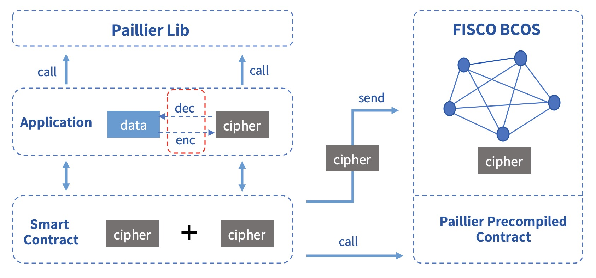
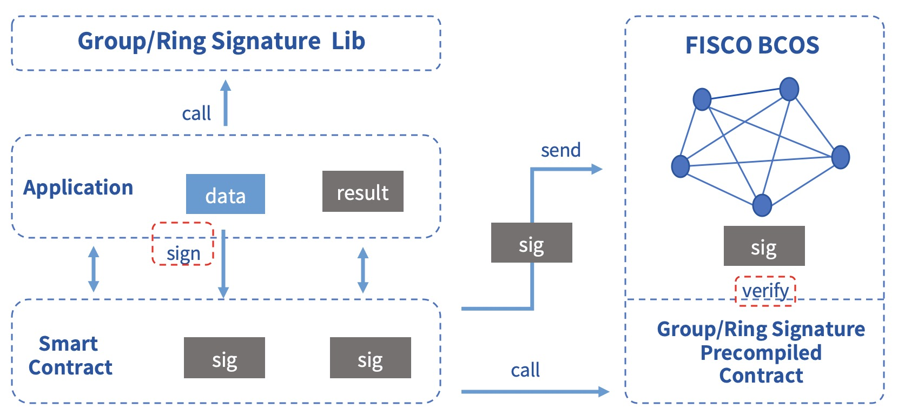

# Privacy protection

Privacy protection is a major technical challenge for the alliance chain. In order to protect the data, keep the anonymity of alliance members, and ensure the effectiveness of supervision，FISCO BCOS integrates homomorphic encryption and group/ring signature algorithms in [Precompiled Contracts](https://fisco-bcos-documentation.readthedocs.io/zh_CN/latest/docs/manual/smart_contract.html#id2), providing multiple privacy protection methods.

```eval_rst
.. note::
    1. FISCO BCOS 2.3.0+ supports homomorphic encryption, group signature and ring signature
    2. FISCO BCOS 2.3.0, 2.4.0 and 2.4.1, you need to manually compile the binary to enable the privacy protection module
    3. FISCO BCOS 2.5.0+ enables privacy protection module by default
```

## Homomorphic encryption

### Introduction

Homomorphic Encryption is one of the jewels in the field of public key cryptosystems. It has more than 40 years of research history, and its wonderful cryptographic characteristics have attracted wide attention。

- Homomorphic encryption is essentially a public key encryption algorithm, that is, the public key is used for encryption, and the private key is used for decryption.
- Homomorphic encryption allows computation on ciphertexts, generating an encrypted result which, when decrypted, matches the result of the operations as if they had been performed on the plaintext.
- Formula description：


FISCO BCOS uses the paillier encryption algorithm which supports addition homomorphism. Paillier key pairs are compatible with mainstream RSA public key encryption algorithms, and the use costs is low. At the same time, paillier, as a lightweight homomorphic encryption algorithm, has low calculation overhead and is easily accepted by business systems. Therefore, after balancing the trade-off between functionality and usability, the paillier algorithm was finally selected.


### Components

Components of FISCO BCOS homomorphic encryption module include:

- paillier[library](https://github.com/FISCO-BCOS/paillier-lib), provides java version library and c++ version homomorphic interface.

- paillier[precompiled contract](#id17), provides homomorphic interface for smart contracts.

### Suggestion

For services that require privacy protection, if it needs simple ciphertext calculation, this module can be used to fulfill related demands. All data on the chain can be encrypted by calling the paillier library. The ciphertext data on the chain can be homomorphically added by calling the paillier precompiled contract. After the ciphertext is returned to the application layer, it can be decrypted by calling the paillier library. The specific process is shown in the following figure:



### Scenario

In the alliance chain, different business scenarios need to be equipped with different privacy protection policies. For businesses with strong privacy, such as reconciliation between financial institutions, it is necessary to encrypt asset data. In FISCO BCOS, the user can call the homomorphic encryption library to encrypt the data. When the consensus node executes the transaction, the homomorphic encryption precompiled contract is called to obtain the result of the ciphertext calculation.

## Group/Ring signature

### Introduction

**Group signature**

Group signature is a digital signature scheme that can protect the identity of the signer. Users can sign messages instead of the group they belong to, and the verifier can verify whether the signature is valid. In this case, the verifier could not know which group member the signature belongs to. However, users cannot abuse this anonymous behavior, because the group administrator can open the signature through the group owner's private key, exposing the attribution information of the signature. Group signature features include:

- Anonymity: group members use group parameters to generate signatures, others can only verify the validity of the signature, and know the group to which the signer belongs through the signature, but cannot obtain the identity information of the signer;
- Unforgeability: only group members can generate valid and verifiable group signatures;
- Unlinkability: given two signatures, it is impossible to determine whether they are from the same signer;
- Traceability: the group owner can obtain the signer identity through signature.

**Ring signature**

Ring signature is a special group signature scheme, but has complete anonymity, that is, there is no administrator, users can actively join the ring, and the signature cannot be opened. Ring signature features include:

- Unforgeability: other members in the ring cannot fake the signature of the real signer;
- Full anonymity: there is no administrator, others can only verify the validity of the ring signature, but no one can obtain the identity information of the signer.

### Components

Components of FISCO BCOS group/ring signature module include:

- group/ring signature[library](https://github.com/FISCO-BCOS/group-signature-lib), provides c++ version library.

- group/ring signature[precompiled contracts](#id17), provides verify interfaces for smart contracts.

### Suggestion

Services that have the need to hide the identity of the signer can use this module to fulfill related demands. The user signs the data by calling the group/ring signature library, and then uploads the signature. The application contracts verifies the signature by calling the group/ring signature precompiled contracts, and returns the verification result back to the application layer. If it is a group signature, the supervisor can also open the specified signature data to obtain the identity of the signer. The specific process is shown in the following figure:



### Scenario

Due to its natural anonymity, group/ring signature has broad application prospects in scenarios where participants' identities need to be hidden, such as anonymous voting, anonymous auctions, anonymous auctions, etc., and can even be used in the blockchain with UTXO model to achieve anonymous transfers. At the same time, due to the traceability of group signature, it can be used in scenarios that require regulatory intervention. The supervisor acts as the group owner or entrusts the group owner to reveal the identity of the signer.

## How to start

### Build chain

Make sure you are in the `FISCO-BCOS/build` directory, and execute the following command to build a local 4-node chain. [Refer to here](https://fisco-bcos-documentation.readthedocs.io/zh_CN/latest/docs/manual/build_chain.html) to get more build options.

```bash
bash ../manual/build_chain.sh -l 127.0.0.1:4 -e bin/fisco-bcos
```

## Precompiled contract interface

The code of the privacy module is put together with the precompiled contracts developed by the user, located in the `FISCO-BCOS/libprecompiled/extension` directory. The calling method of the privacy module is exactly the same as the [calling method](https://fisco-bcos-documentation.readthedocs.io/en_US/latest/docs/manual/smart_contract.html#id12) of the precompiled contract developed by the user, but there are two points to note:

1. Addresses have been assigned to the precompiled contracts for the privacy module and no additional registration is required. The precompiled contract list and address allocation of the privacy module are as follows:

   | Addresses   | Function   | [Resource](https://github.com/FISCO-BCOS/FISCO-BCOS/tree/master/libprecompiled/extension) |
   | ------ | ---------- | ------------------------------------------------------------ |
   | 0x5003 | Homomorphic encryption   | PaillierPrecompiled.cpp                                      |
   | 0x5004 | Group signature     | GroupSigPrecompiled.cpp                                      |
   | 0x5005 | Ring signature     | RingSigPrecompiled.cpp                                       |

2. Need to declare the interfaces of the precompiled contracts through the `solidity` contract. The contract files need to be saved in the console contract directory `console/contracts/solidity`. The contract interface of each privacy function is as follows:

- Homomorphic encryption

  ```solidity
  // PaillierPrecompiled.sol
  pragma solidity ^0.4.24;
  contract PaillierPrecompiled{
      function paillierAdd(string cipher1, string cipher2) public constant returns(string);
  }
  ```

- Group signature

  ```solidity
  // GroupSigPrecompiled.sol
  pragma solidity ^0.4.24;
  contract GroupSigPrecompiled{
  		function groupSigVerify(string signature, string message, string gpkInfo, string paramInfo) public constant returns(bool);
  }
  ```

- Ring signature

  ```solidity
  // RingSigPrecompiled.sol
  pragma solidity ^0.4.24;
  contract RingSigPrecompiled{
       function ringSigVerify(string signature, string message, string paramInfo) public constant returns(bool);
  }
  ```

## Called by console

After building the chain by the newly compiled binary, deploy the console (version v1.0.2 or later), and copy the interface declaration files to the console contract directory. Take calling homomorphic encryption as an example:

```solidity
# start the console in the console directory
bash start.sh

# call contract
call PaillierPrecompiled 0x5003 paillierAdd "0100E97E06A781DAAE6DBC9C094FC963D73B340D99FD934782A5D629E094D3B051FBBEA26F46BB681EB5314AE98A6A63805834E26BD0154243581DD77709C5DB15357DBEC34F8D8B9D5892FDF5F5FC56B1474CF58D6AC23AA867E34653B469058DCDBDC283D493711022131FBCBCFAC639919A7C0FE45EECDBD43FA543492D3058737F567626318282C2C35027B05E901F45CB3B71479FC49FD08B3F81C82326DEF28739D6A7D090F93D1B5058CDA89134AB103DB49EA51FF14310179FF9B3284BC6C3B6BA3BB0FCB35FEA6AF1453A4AAEB3EB82E9B99875BEA89CD970905B40E6E5FC906F0959769865FF29A83CD23ACC0C832A0DE30D0C691335A7ABE2EA0782778E14DAACACD60767862D5E285E8FB7B6D62C9AABE1BE751DD68001F492D6FD4C46583B25FF1806A954E8DB5ED935C5A2CA6816C4EDB48D4A41D146E09EF1CA5AFECC38F38E4147D9C6D07429F058266CC879AF8AA88510E85608756585C8D78400DFFA32244B99DC1A533780CAEA07578AF340C3C4ABED09355A006FCE99F22BE113F5317256198ACB6CA9D8501EDF42A11CFCCF677755D081E48249B9345FA8C2F73E6CB37CB17C2A5A1EA4DC44949A63E8DA45F3DCE827654688312F399873E897CDD413C84DC0891884BEF8ECBC99F48CBB3DA2D04B40CDCB03A6CD8FDC11277A5AA5F73DB6B828AB24978480604D0143A0A5020EE985A88EEC73FD9DF205E5CD5C54C06ADD092E839B91F28887C9BF7775275552E1B673997A792683B784827078CC7BF7121318B0565739588268372EDD320B1BB2FEE8D873222C00AF93D07C0572BF3E089806EA7E3C8D334973B4BE61E31E389CB919FCEE834E1D9EBA624DE324D85425BCCDF8C3F8F3A94E33A307CAAE5922E46FFE96A521ECB6E7D681E7CF6A1900EEF0DDF23ADEC6EFA8842110FF1F266AEDA7B501DBC94D20817DD43D9EB056E3DA4DA977E85A53207F2C229F9302EB5029B5C31EE40FC7E25591CDC6B4AD206BDFB50C5F7D2DA2D6B8AB7A6B575C20FDD12A37EBECF27D60B651842DED09776218613F72628C1A3540252895A192DF51A1B7479EFC45A4B489FC" "0100E97E06A781DAAE6DBC9C094FC963D73B340D99FD934782A5D629E094D3B051FBBEA26F46BB681EB5314AE98A6A63805834E26BD0154243581DD77709C5DB15357DBEC34F8D8B9D5892FDF5F5FC56B1474CF58D6AC23AA867E34653B469058DCDBDC283D493711022131FBCBCFAC639919A7C0FE45EECDBD43FA543492D3058737F567626318282C2C35027B05E901F45CB3B71479FC49FD08B3F81C82326DEF28739D6A7D090F93D1B5058CDA89134AB103DB49EA51FF14310179FF9B3284BC6C3B6BA3BB0FCB35FEA6AF1453A4AAEB3EB82E9B99875BEA89CD970905B40E6E5FC906F0959769865FF29A83CD23ACC0C832A0DE30D0C691335A7ABE2EA07827736DDD4C285AB8C5F53DA58502BD2E312C939139E591C83D009C763836B05676CEDE46C9BFEBA7AF6242739F1E27A0AABB13F37CFF2DFEE5D14D52A660FDD012748025F9915585123FD263E211C594A0EDB7AFDA1240A2C340C44C3568FA47AB2CC00459DF31828C56CAC0284B5D0D3BC3D6F37969FACED77B03107B88F60A73E1F9FEBE6152FB00BDAECA9954AC28D4D9599FE234AF2E52748DBEB65570F2B99A638C275235494189B887FAEA39FE12CB1BAE9AE085E353D4DC01863052FE141D87D98E78C46FFD0F634D498E4E4B2F87B60D505F8401DCCC1BC0D9E32B8C5AF6A6257DB61DDD166CC17E712626218C16D00C24042D928028972816919C1CD9E1AB2F3135D798BE795D79013C3BDE507811E05D88050E7DF1BD3ED0EB7405BA21E854551A7EBD6351E0B9300428C77B1FA532DB9C5D9A0D4BB9F7E96BAFA259D419D75398141801B148C3EF9AE437A424E4E781238964C10EE39260DD0058392CD83C1DFEDAE2D557E5E7D643608B1BB0327AB92550A66F6D636F9F638A5077D721E6BD9344851E3FE288984F120C05A62DD9E283498B5AD680E91E0CBAD3093598B54E8A6964EB406068BB765945B182CD5EBC8910F2DE80C902751EEB77FCB583784DD852E4B6FF2CC1EBA44A5F750B2AD11240F7B95D87055F3CC5A837FA682117ACA1787CF107C9D4B111C8B9FBB78553452E351A8F0E3C50F536CA3304C"

# the result
0100E97E06A781DAAE6DBC9C094FC963D73B340D99FD934782A5D629E094D3B051FBBEA26F46BB681EB5314AE98A6A63805834E26BD0154243581DD77709C5DB15357DBEC34F8D8B9D5892FDF5F5FC56B1474CF58D6AC23AA867E34653B469058DCDBDC283D493711022131FBCBCFAC639919A7C0FE45EECDBD43FA543492D3058737F567626318282C2C35027B05E901F45CB3B71479FC49FD08B3F81C82326DEF28739D6A7D090F93D1B5058CDA89134AB103DB49EA51FF14310179FF9B3284BC6C3B6BA3BB0FCB35FEA6AF1453A4AAEB3EB82E9B99875BEA89CD970905B40E6E5FC906F0959769865FF29A83CD23ACC0C832A0DE30D0C691335A7ABE2EA0782774D011D9A668B26E65506EF2E8B3EBA70B882DE36FEC5951B64B9D967EE5E05B1AF62EE569358360C43220A756E7FB610FCBD5A366D077C48342EE3025735D6590531A7E609ADE2608BB4173167F972AB860674DB89769E2D97EE3E308D3CA04802EF8F85BC6BFCD270F1FC6AEA5C09F51E8914273D8BD7833D55D9AF3D0102315880A57D531E30EDD8E777CDE8708AE7DDF83A8C5B48854FD4CD4E7372CED017C0BACD49E409C45F7071113B12494D3955BA1D7618E196A14012B11ADB63B857C9033604575FC7FF1D5833A53ACDE8877311FFE78F0CAEBAA27B0E5ADCDD809AEDCD5C7D2CA7F15E53AB7D62ADF04686E05B1F79CA91AFD2CE120AAD7D0F15C8E7B59968CE13BA10C99B50BE696C22A59109C3E6E5EDBE364FF5717443C175DEE5680908AEF67AF6261644AEEFAD42538A8686481CF0109296D1A2FF030143A0DED95F54CC158BF3A3FCD0B2278BDB6942D6E536CA45E3015B764FF5A94B57D232F86CFC66A29C55B9A78336026FFB6D8882E6F4CE2F8D007C225B6B3DE814FC60EB278B25FB0A1F6B4A34E920CA952BC3F14D121D5438E12634AD951EBD5911B281E3ADEC43410B91DC28B68F9D79D7F203245E87EE1DB3883B0C925C5A9BA157AB2F07ACD9A09F89EF211EED16358E78EDAF091FBA914225BF8A7DCDD2DD12EC0ABBC10E9E5F7DD48239B0A68CBD81637B1C0D7ED1DF89D714DFC6C1B7B6B3
```

**Note:** The inputted ciphertexts can be generated through the [java library](https://github.com/FISCO-BCOS/paillier-lib/tree/master/paillierJava) in the paillier library.

## Called by solidity contract

Take homomorphic encryption as an example. First, create a precompiled contract object in the solidity contract and call its interface, then create a `CallPaillier.sol` file in the console`console/contracts/solidity`. The file content is as follows:

```solidity
// CallPaillier.sol
pragma solidity ^0.4.24;
import "./PaillierPrecompiled.sol";

contract CallPaillier {
    PaillierPrecompiled paillier;
    function CallPaillier() {

        // call PaillierPrecompiled contract
        paillier = PaillierPrecompiled(0x5003);
    }
    function add(string cipher1, string cipher2) public constant returns(string) {
        return paillier.paillierAdd(cipher1, cipher2);
    }
}
```

Deploy the `CallPaillier` contract, and then call the `add` interface. Using the above ciphertext as inputs, you will get the same result.
