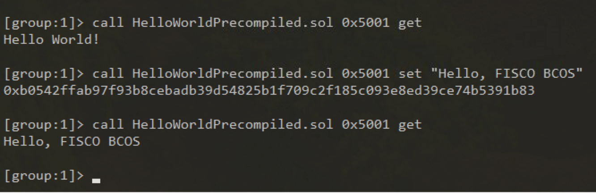
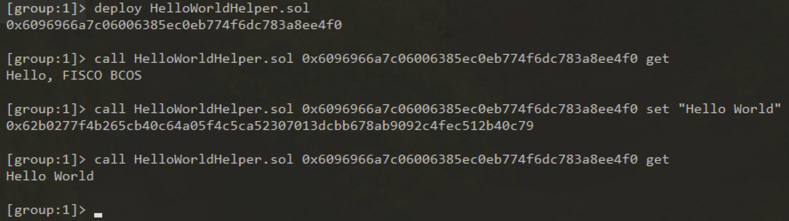

# Smart contract development

FISCO BCOS platform currently supports three smart contract forms which are Solidity, CRUD, and pre-compiled.
- The Solidity contract is the same as Ethereum on supporting the latest version.
- The CRUD interface supporting the distributed storage pre-compilation contract in the Solidity contract, which can store the data of Solidtiy contract in the AMDB table structure, realizes the separation of contract logic and data.
- The precompiled (precompiled) contract is developed in C++ and built into the FISCO BCOS platform. It has better performance than the Solidity contract. Its contract interface that needs to be pre-determined when compiling, is suitable for the scenarios with fixed logic but consensus, such as group configuration. The development of precompiled contracts will be introduced in the next section.


### [Solidity contract development](https://solidity.readthedocs.io/en/latest/)

- [Solidity official file](https://solidity.readthedocs.io/en/latest/)
- [Remix online IDE](https://remix.ethereum.org/)

### To use contract CRUD interface

Accessing AMDB requires using the AMDB-specific smart contract interface `Table.sol` which is a database contract that can create tables and add, delete, and modify the tables.

```eval_rst
.. note::

    To make the table created by AMDB accessible to multiple contracts, it should have a unique name that acknowledged globally. So it is unable to create tables with same name within one group on the same chain

```

`Table.sol` file code is as follows:

```js
pragma solidity ^0.4.24;

contract TableFactory {
    function openTable(string) public constant returns (Table);  // open table
    function createTable(string,string,string) public returns(int);  // create table
}

// inquiry conditions
contract Condition {
    //equal to
    function EQ(string, int) public;
    function EQ(string, string) public;

    //unequal to
    function NE(string, int) public;
    function NE(string, string)  public;

    //greater than
    function GT(string, int) public;
    //greater than or equal to
    function GE(string, int) public;

    //smaller than
    function LT(string, int) public;
    //smaller than or equal to
    function LE(string, int) public;

    //limit the number of return record
    function limit(int) public;
    function limit(int, int) public;
}

// single entry data record
contract Entry {
    function getInt(string) public constant returns(int);
    function getAddress(string) public constant returns(address);
    function getBytes64(string) public constant returns(byte[64]);
    function getBytes32(string) public constant returns(bytes32);
    function getString(string) public constant returns(string);
    
    function set(string, int) public;
    function set(string, string) public;
    function set(string, address) public;
}

// data record set
contract Entries {
    function get(int) public constant returns(Entry);
    function size() public constant returns(int);
}

// Table main type
contract Table {
    // select interface
    function select(string, Condition) public constant returns(Entries);
    // insert interface
    function insert(string, Entry) public returns(int);
    // update interface
    function update(string, Entry, Condition) public returns(int);
    // remove interface
    function remove(string, Condition) public returns(int);

    function newEntry() public constant returns(Entry);
    function newCondition() public constant returns(Condition);
}
```

```eval_rst
.. important::
   There can be multiple records under the primary key in the Table of the current CRUD interface. The feature will be deprecated after v2.3.0. The primary key can only correspond to one record.
```

To provide a contract case `TableTest.sol`. The code is as follows:

```js
pragma solidity ^0.4.24;

import "./Table.sol";

contract TableTest {
    event CreateResult(int count);
    event InsertResult(int count);
    event UpdateResult(int count);
    event RemoveResult(int count);

    // create table
    function create() public returns(int){
        TableFactory tf = TableFactory(0x1001);  // TableFactory's address is fixed at 0x1001
        // To create a table t_test. Table's key_field as name. Table's value_field as item_id and item_name.
        // key_field indicates the row that AMDB's primary key value_field represents in the table. The row can be multiple and spearated by commas.
        int count = tf.createTable("t_test", "name", "item_id,item_name");
        emit CreateResult(count);

        return count;
    }

    // inquiry data
    function select(string name) public constant returns(bytes32[], int[], bytes32[]){
        TableFactory tf = TableFactory(0x1001);
        Table table = tf.openTable("t_test");

        // If the condition is empty, it means no filtering. You can use conditional filtering as needed.
        Condition condition = table.newCondition();

        Entries entries = table.select(name, condition);
        bytes32[] memory user_name_bytes_list = new bytes32[](uint256(entries.size()));
        int[] memory item_id_list = new int[](uint256(entries.size()));
        bytes32[] memory item_name_bytes_list = new bytes32[](uint256(entries.size()));

        for(int i=0; i<entries.size(); ++i) {
            Entry entry = entries.get(i);

            user_name_bytes_list[uint256(i)] = entry.getBytes32("name");
            item_id_list[uint256(i)] = entry.getInt("item_id");
            item_name_bytes_list[uint256(i)] = entry.getBytes32("item_name");
        }

        return (user_name_bytes_list, item_id_list, item_name_bytes_list);
    }
    // insert data
    function insert(string name, int item_id, string item_name) public returns(int) {
        TableFactory tf = TableFactory(0x1001);
        Table table = tf.openTable("t_test");

        Entry entry = table.newEntry();
        entry.set("name", name);
        entry.set("item_id", item_id);
        entry.set("item_name", item_name);

        int count = table.insert(name, entry);
        emit InsertResult(count);

        return count;
    }
    // update data
    function update(string name, int item_id, string item_name) public returns(int) {
        TableFactory tf = TableFactory(0x1001);
        Table table = tf.openTable("t_test");

        Entry entry = table.newEntry();
        entry.set("item_name", item_name);

        Condition condition = table.newCondition();
        condition.EQ("name", name);
        condition.EQ("item_id", item_id);

        int count = table.update(name, entry, condition);
        emit UpdateResult(count);

        return count;
    }
    // remove data
    function remove(string name, int item_id) public returns(int){
        TableFactory tf = TableFactory(0x1001);
        Table table = tf.openTable("t_test");

        Condition condition = table.newCondition();
        condition.EQ("name", name);
        condition.EQ("item_id", item_id);

        int count = table.remove(name, condition);
        emit RemoveResult(count);

        return count;
    }
}
```

`TableTest.sol` has called the intelligent contract `Table.sol` of AMDB, which implements creating the user table `t_test` and the functions of adding, deleting and changing `t_test`. The `t_test` table is structured as follows. This table records the item and item's numbers used by a employees.

|name*|item_name|item_id|
|:----|:----|:------|
|Bob|Laptop|100010001001|

```eval_rst
.. important::
The client requiring to call the contract code which is converted to Java file, needs to put TableTest.sol and Table.sol into the directory contracts/solidity, and TableTest.java is generated by the compile script of sol2java.sh.
```


## Precompiled contract development

### 1. Introduction


Precompiled contract is a natively supported feature of Ethereum: a contract that uses C++ code to implement specific functions at the underlying platform for EVM module calling. FISCO BCOS inherits and extends this feature, and has developed a powerful and easy-to-expand framework on this basis of it.[precompiled design principle](../design/virtual_machine/precompiled.md).

This article is an introductory to guide users on how to implement their own precompiled contracts and how to call them.


### 2. Implement precompiled contracts

#### 2.1 Process
The process of implementing a pre-compiled contract:
```eval_rst
.. mermaid::
    graph LR
        a(assign contract address) -->b(define contract interface)
        b -->c(design storage structure)
        c -->d(implement contract logic)
        d-->e(register contract)
```

- **assign contract address**  

For calling a solid contract or pre-compiled contract, you need to distinguish it by the contract address and address space.


| address use | address range |
| --------- | --------- |
| ethereum precompiled | 0x0001-0x0008 |
| reserve | 0x0008-0x0fff |
| FISCO BCOS precompiled | 0x1000-0x1006 |
| FISCO BCOS reserve | 0x1007-0x5000 |
| user assigned interval | 0x5001 - 0xffff |
| CRUD temporary contract | 0x10000+ |
| solidity | others |


The address range of user assigned interval is `0x5001`-`0xffff`. Users needs to assign an unused address to the new precompiled contract. **The precompiled contract addresses must be unique and not conflicting**.


List of precompiled contracts and address assignments implemented in FISCO BCOS:

| address   | feature   | source code ([libprecompiled directory](https://github.com/FISCO-BCOS/FISCO-BCOS/tree/master/libprecompiled)) |
|--------|--------|---------|
| 0x1000 | system parameter management | SystemConfigPrecompiled.cpp |
| 0x1001 | table factory contract | TableFactoryPrecompiled.cpp |
| 0x1002 | CRUD contract | CRUDPrecompiled.cpp |
| 0x1003 | consensus node management | ConsensusPrecompiled.cpp |
| 0x1004 | CNS feature | CNSPrecompiled.cpp |
| 0x1005 | storage table authority management | AuthorityPrecompiled.cpp |
| 0x1006 | parallel contract configuration | ParallelConfigPrecompiled.cpp |

- **define contract interface**  

It is similar to solidity contract. When designing a contract, you need to determine the ABI interface of the contract first. The ABI interface rules of the precompiled contract are exactly the same as the solidity. [solidity ABI link](https://solidity.readthedocs.io/en/latest/abi-spec.html).


> When defining a precompiled contract interface, you usually need to define a solidity contract with the same interface, and empty the function body of all interfaces. This contract is called **interface contract** of the precompiled contract. The interface contract need to be used when calling the precompiled contract.

```js
    pragma solidity ^0.4.24;
    contract Contract_Name {
        function interface0(parameters ... ) {}
        ....
        function interfaceN(parameters ... ) {}
    }
```

- **design storage structure**  

When a precompiled contract involves a storage operation, it needs to determine the stored table information (table name and table structure. The stored data will be uniformly abstracted into a table structure in FISCO BCOS)[storage structure](../design/storage/storage.md).

```eval_rst
.. note::
    This process can be omitted without involving a storage operation.
```

- **implement contract logic**  

For implementing the calling logic of the new contract, you need to implement a new C++ class that needs to inherit [precompiled] (https://github.com/FISCO-BCOS/FISCO-BCOS/blob/master/libblockverifier/Precompiled.h) #L37 ) to overload the call function for achieving the calling behaviour of each interface.

```cpp
    // libblockverifier/Precompiled.h
    class Precompiled
    {
        virtual bytes call(std::shared_ptr<ExecutiveContext> _context, bytesConstRef _param,
            Address const& _origin = Address()) = 0;
    };
```
The call function has three parameters:

`std::shared_ptr<ExecutiveContext> _context : ` the context for the transaction execution saving

`bytesConstRef _param : ` calling the parameter information of the contract. The calling corresponding contract interface and the parameters of interface can be obtained from _param parsing.

`Address const& _origin : ` transaction sender for permission control

How to implement a Precompiled class will be detailed in the sample below.

- **register contract**  

Finally, the contract address and the corresponding class need to be registered to the execution context of the contract, so that the execution logic of the contract can be correctly recognized when the precompiled contract is called by the address. To view the registered [pre-compiled contract list](https://github.com/FISCO-BCOS/FISCO-BCOS/blob/master/libblockverifier/ExecutiveContextFactory.cpp#L36).

Registration path:

```
    file        libblockverifier/ExecutiveContextFactory.cpp
    function    initExecutiveContext  
```

#### 2.2 sample contract development

```js
// HelloWorld.sol
pragma solidity ^0.4.24;

contract HelloWorld{
    string name;

    function HelloWorld(){
       name = "Hello, World!";
    }

    function get()constant returns(string){
        return name;
    }

    function set(string n){
    	name = n;
    }
}
```

The above source code is the HelloWorld contract written by solidity. This chapter will implement a precompiled contract with the same function to enable user step by step to have an visual understanding to the precompiled contract.
sample c++[source code path](https://github.com/FISCO-BCOS/FISCO-BCOS/blob/master/libprecompiled/extension/HelloWorldPrecompiled.cpp):

```cpp
    libprecompiled/extension/HelloWorldPrecompiled.h
    libprecompiled/extension/HelloWorldPrecompiled.cpp
```

##### 2.2.1 assign contract address

Referring to the address range, the address of the HelloWorld precompiled contract is assigned as:

```
0x5001
```

##### 2.2.2 define contract interface

We need to implement the HelloWorld contract function. The interface is the same as the HelloWorld interface. HelloWorldPrecompiled interface contract:
```js
pragma solidity ^0.4.24;

contract HelloWorldPrecompiled {
    function get() public constant returns(string) {}
    function set(string _m) {}
}
```

##### 2.2.3 design storage structure

HelloWorldPrecompiled needs to store the string value of the set, so when it comes to storage operations, you need to design the stored table structure.

table name: ```_ext_hello_world_```

table structure:

|key       | value
----------|------------
|hello_key | hello_value


The table stores only a pair of key-value pairs. The key field is hello_key and the value field is hello_value. For storing the corresponding string value, it can be modified by the set(string) interface and obtained by the get() interface.

##### 2.2.4 implement call logic

To add the HelloWorldPrecompiled class, overload the call function, and implement the calling behavior of all interfaces.[call function source code](https://github.com/FISCO-BCOS/FISCO-BCOS/blob/master/libprecompiled/extension/HelloWorldPrecompiled.cpp#L66).


The user-defined Precompiled contract needs to add a new class for defining the calling behaviour of the contract in the class. In the example, for adding the HelloWorldPrecompiled class, the following work must complete:


- interface registration
```c++
// define all interfaces in the class
const char* const HELLO_WORLD_METHOD_GET = "get()";
const char* const HELLO_WORLD_METHOD_SET = "set(string)";

// register interface in the constructor
HelloWorldPrecompiled::HelloWorldPrecompiled()
{
    // name2Selector is a member of the Base class Precompiled, which saves the mapping relationship of the interface call.
    name2Selector[HELLO_WORLD_METHOD_GET] = getFuncSelector(HELLO_WORLD_METHOD_GET);
    name2Selector[HELLO_WORLD_METHOD_SET] = getFuncSelector(HELLO_WORLD_METHOD_SET);
}
```

- table creation  

define the table's name and field structure
```c++
// define the name
const std::string HELLO_WORLD_TABLE_NAME = "_ext_hello_world_";
// define the key field
const std::string HELLOWORLD_KEY_FIELD = "key";
// "field0,field1,field2" define other fields, multiple fields separated by commas, such as "field0,field1,field2"
const std::string HELLOWORLD_VALUE_FIELD = "value";
```

```c++
// In the call function, the table is opened when it exists, otherwise the table is created first.
Table::Ptr table = openTable(_context, HELLO_WORLD_TABLE_NAME);
if (!table)
{
    //  table is created while it does not exist
    table = createTable(_context, HELLO_WORLD_TABLE_NAME, HELLOWORLD_KEY_FIELD,
        HELLOWORLD_VALUE_FIELD, _origin);
    if (!table)
    {
        //  fail to create and return false
    }
}
```
After getting the operation handle of the table, user can implement the specific logic of the table operation.

- call interface distinguishing

Parsing _param with getParamFunc can distinguish the call interface.

**Note: the contract interface must be registered in the constructor**

```c++
uint32_t func = getParamFunc(_param);
if (func == name2Selector[HELLO_WORLD_METHOD_GET])
{  
    // get() call interface logic
}
else if (func == name2Selector[HELLO_WORLD_METHOD_SET])
{  
    // set(string) call interface logic
}
else
{  
    // unknown interface, call error, return error
}
```

-  Parameter parsing and result return

The parameters during calling the contract are included in the _param parameter of the call function. They are encoded according to the Solidity ABI format. The `dev::eth::ContractABI` utility class can be used to parse the parameters. Similarly, when the interface returns, the return value also needs to be encoded according to the format. [Solidity ABI](https://solidity.readthedocs.io/en/latest/abi-spec.html)。


In `dev::eth::ContractABI` class, we need to use two interfaces `abiIn abiOut`. The former serializes the former user parameter and the latter can parse the parameter from the serialized data.

```c++
// to serialize ABI data. c++ type data serialized to the format used by evm
// _id: The corresponding string of the function interface declaration, which generally default to ""
template <class... T> bytes abiIn(std::string _id, T const&... _t)
// to parse serialized data into c++ type data
template <class... T> void  abiOut(bytesConstRef _data, T&... _t)
```

The sample code below shows how the interface works:

```c++
// for transfer interface: transfer(string,string,uint256)

// Parameter1
std::string str1 = "fromAccount";
// Parameter12
std::string str2 = "toAccount";
// Parameter13
uint256 transferAmoumt = 11111;

dev::eth::ContractABI abi;
// serialization, abiIn first string parameter default to ""
bytes out = abi.abiIn("", str1, str2, transferAmoumt);

std::string strOut1;
std::string strOut2;
uint256 amoumt;

// parse parameter
abi.abiOut(out, strOut1, strOut2, amount);
// parse after
// strOut1 = "fromAccount";
// strOut2 = "toAccount"
// amoumt = 11111
```

Finally, the HelloWorldPrecompiled call function is implemented completely.[source code link](https://github.com/FISCO-BCOS/FISCO-BCOS/blob/master/libprecompiled/extension/HelloWorldPrecompiled.cpp#L66).

```c++
bytes HelloWorldPrecompiled::call(dev::blockverifier::ExecutiveContext::Ptr _context,
    bytesConstRef _param, Address const& _origin)
{
    // parse function interface
    uint32_t func = getParamFunc(_param);
    //
    bytesConstRef data = getParamData(_param);
    bytes out;
    dev::eth::ContractABI abi;

    // open table
    Table::Ptr table = openTable(_context, HELLO_WORLD_TABLE_NAME);
    if (!table)
    {
        // table is created while it does not exist
        table = createTable(_context, HELLO_WORLD_TABLE_NAME, HELLOWORLD_KEY_FIELD,
            HELLOWORLD_VALUE_FIELD, _origin);
        if (!table)
        {
            // fail to create table. no authority?
            out = abi.abiIn("", CODE_NO_AUTHORIZED);
            return out;
        }
    }

    // to distinguish the calling interface and specify the calling logic of each interface
    if (func == name2Selector[HELLO_WORLD_METHOD_GET])
    {  // get() call interface
        // default to return value
        std::string retValue = "Hello World!";
        auto entries = table->select(HELLOWORLD_KEY_FIELD_NAME, table->newCondition());
        if (0u != entries->size())
        {
            auto entry = entries->get(0);
            retValue = entry->getField(HELLOWORLD_VALUE_FIELD);
        }
        out = abi.abiIn("", retValue);
    }
    else if (func == name2Selector[HELLO_WORLD_METHOD_SET])
    {  // set(string) call interface

        std::string strValue;
        abi.abiOut(data, strValue);
        auto entries = table->select(HELLOWORLD_KEY_FIELD_NAME, table->newCondition());
        auto entry = table->newEntry();
        entry->setField(HELLOWORLD_KEY_FIELD, HELLOWORLD_KEY_FIELD_NAME);
        entry->setField(HELLOWORLD_VALUE_FIELD, strValue);

        int count = 0;
        if (0u != entries->size())
        {  // value exists, update
            count = table->update(HELLOWORLD_KEY_FIELD_NAME, entry, table->newCondition(),
                std::make_shared<AccessOptions>(_origin));
        }
        else
        {  // value does not exist, insert
            count = table->insert(
                HELLOWORLD_KEY_FIELD_NAME, entry, std::make_shared<AccessOptions>(_origin));
        }

        if (count == CODE_NO_AUTHORIZED)
        {  // no table operation authority
            PRECOMPILED_LOG(ERROR) << LOG_BADGE("HelloWorldPrecompiled") << LOG_DESC("set")
                                   << LOG_DESC("non-authorized");
        }
        out = abi.abiIn("", u256(count));
    }
    else
    {  // parameter error, unknown calling interface
        PRECOMPILED_LOG(ERROR) << LOG_BADGE("HelloWorldPrecompiled") << LOG_DESC(" unknown func ")
                               << LOG_KV("func", func);
        out = abi.abiIn("", u256(CODE_UNKNOW_FUNCTION_CALL));
    }

    return out;
}
```

##### 2.2.5 Register contract and compile source code

- Register Precompiled contract. Modify `FISCO-BCOS/cmake/templates/UserPrecompiled.h.in`, register the address of `HelloWorldPrecompiled` contract in its below function. Default to be existed, and revoke annotation.

```cpp
void dev::blockverifier::ExecutiveContextFactory::registerUserPrecompiled(dev::blockverifier::ExecutiveContext::Ptr context)
{
    // Address should in [0x5001,0xffff]
    context->setAddress2Precompiled(Address(0x5001), std::make_shared<dev::precompiled::HelloWorldPrecompiled>());
}
```

- Compile source code. Please [read here](get_executable.html#id2) to install dependencies and compile source code.

**Note**：The implemented HelloWorldPrecompiled.cpp and header files should be placed under FISCO-BCOS/libprecompiled/extension directory.

- Build FISCO BCOS consortium blockchain
Given that it is stored under `FISCO-BCOS/build` directory, use the following instruction to build chain for node 4. For more options please [read here](build_chain.md).

```bash
bash ../tools/build_chain.sh -l "127.0.0.1:4" -e bin/fisco-bcos
```

### 3 Calling

From the user's viewing, the pre-compiled contract is basically the same as the solidity contract. The only difference is the solidity contract can obtain the contracted address after deployment while the per-compiled contract can be used directly without deployment because of the pre-compiled contract address is pre-allocated.

#### 3.1 Call HelloWorld precompiled contract using console

Create HelloWorldPrecompiled.sol file under console contracts/solidity with the content of interface declaration:

```bash
pragma solidity ^0.4.24;
contract HelloWorldPrecompiled{
    function get() public constant returns(string);
    function set(string n);
}
```

After the nodes are built by compiled binaries, deploy console v1.0.2 and above version and execute the following statement to call contract:


#### 3.2 Call solidity   

Now, we try to create precompiled contract object and call its interface in Solidity contract. Create HelloWorldHelper.sol file in console contracts/solidity with the following content:

```js
pragma solidity ^0.4.24;
import "./HelloWorldPrecompiled.sol";

contract HelloWorldHelper {
    HelloWorldPrecompiled hello;
    function HelloWorldHelper() {
        // call HelloWorld precompiled contract
        hello = HelloWorldPrecompiled(0x5001);
    }
    function get() public constant returns(string) {
        return hello.get();
    }
    function set(string m) {
        hello.set(m);
    }
}
```

Deploy HelloWorldHelper contract and call the interface of HelloWorldHelper contract, you will get the following result:

